# Домашнее задание: Введение в Terraform

## Выполнил: Шаров Олег

## Задание 1

### 1. Установка и настройка Terraform

Установлена версия Terraform v1.15.5

**Скриншот:** 
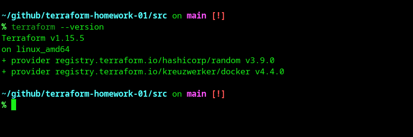

---

### 2. Файл для хранения секретов

**Вопрос:** В каком terraform-файле, согласно `.gitignore`, допустимо сохранить личную, секретную информацию?

**Ответ:** `personal.auto.tfvars`

**Почему:** 
- Файл добавлен в `.gitignore`, поэтому не попадёт в Git-репозиторий
- Terraform автоматически читает все файлы с расширением `.auto.tfvars` и подставляет значения переменных
- Это безопасный способ хранить токены, пароли и ключи локально

---

### 3. Секретное содержимое в state-файле

После выполнения `terraform apply` был создан ресурс `random_password`.

**Найденный секрет:**
- **Ключ:** `result`
- **Значение:** `jlRNeLKX128U5ZAn`

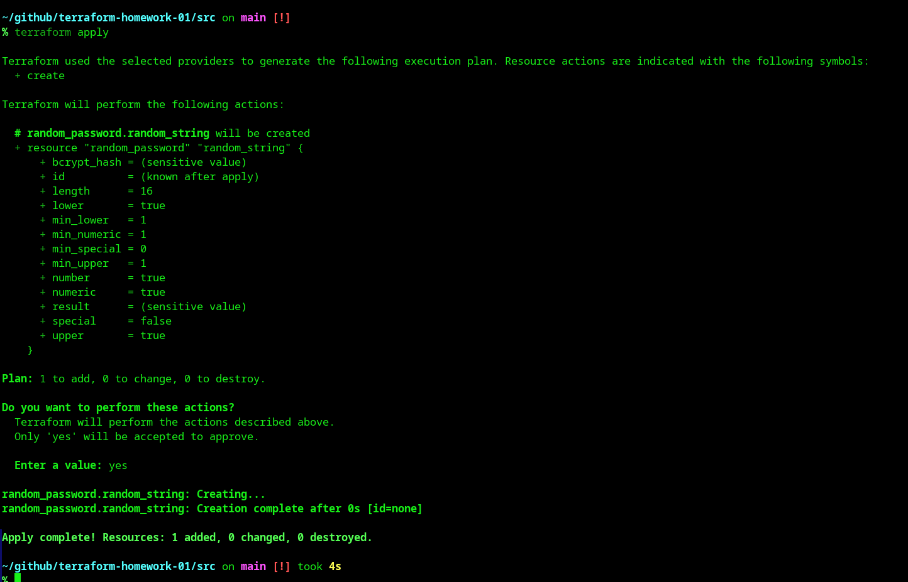

**Важно:** State-файл `terraform.tfstate` хранит секреты в открытом виде, поэтому его нельзя коммитить в Git!

---

### 4. Исправление ошибок в коде

При раскомментировании блока кода и выполнении `terraform validate` были обнаружены ошибки:

**Ошибки:**

1. **Missing name for resource** — у ресурса `docker_image` отсутствовало второе имя (label)
   ```hcl
   # Было (ошибка):
   resource "docker_image" {
   # Стало (правильно):
   resource "docker_image" "nginx" {
   ```

2. **Invalid resource name** — имя ресурса `docker_container` начиналось с цифры `1nginx`
   ```hcl
   # Было (ошибка):
   resource "docker_container" "1nginx" {
   # Стало (правильно):
   resource "docker_container" "nginx" {
   ```

3. **Неверная ссылка на ресурс** — в интерполяции указано несуществующее имя ресурса
   ```hcl
   # Было (ошибка):
   name = "example_${random_password.random_string_FAKE.resulT}"
   # Стало (правильно):
   name = "example_${random_password.random_string.result}"
   ```

Ошибки валидации
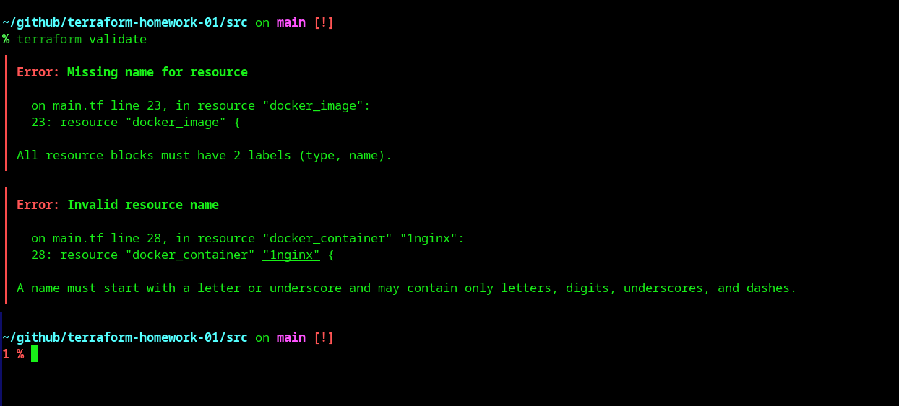 

Успешная валидация
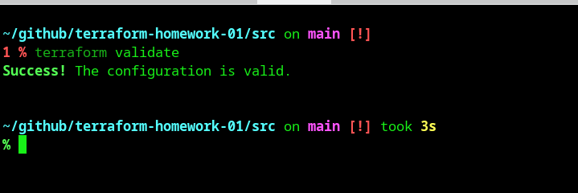 
---

### 5. Запуск Docker-контейнера

После исправления ошибок контейнер успешно создан.

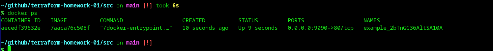

---

### 6. Ключ -auto-approve

**Замена имени контейнера:**
```hcl
name = "hello_world"  # вместо example_${random_password...}
```

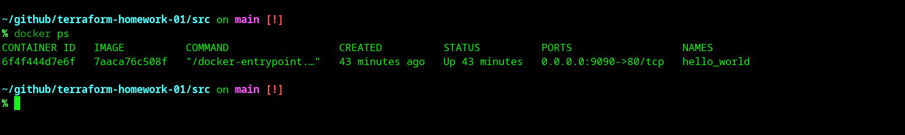

**Опасность ключа `-auto-approve`:**

⚠️ **Почему это опасно:**
- Применяет изменения **без подтверждения** — нет возможности проверить план изменений
- Риск случайного удаления критических ресурсов
- Ошибки в коде могут привести к нежелательным изменениям инфраструктуры
- Особенно опасно в production-средах

✅ **Когда полезен:**
- **CI/CD пайплайны** — автоматическое развёртывание после code review
- **Тестовые среды** — быстрое создание/уничтожение ресурсов
- **Демонстрации** — не нужно вводить `yes` каждый раз

---

### 7. Уничтожение ресурсов

После выполнения `terraform destroy` все ресурсы удалены.

Вывод команды terraform destroy
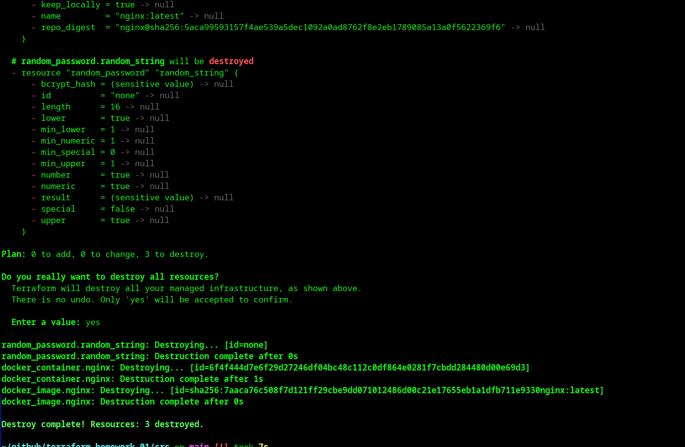 

Содержимое state-файла (пустой)
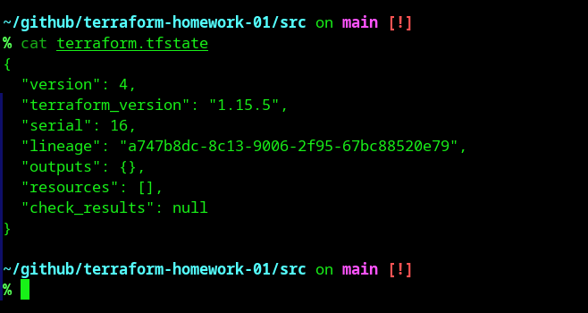

---

### 8. Почему не удалён образ nginx:latest?

**Ответ из кода:**

В файле `main.tf` указан параметр `keep_locally = true`:

```hcl
resource "docker_image" "nginx" {
  name         = "nginx:latest"
  keep_locally = true
}
```

**Ответ из документации:**

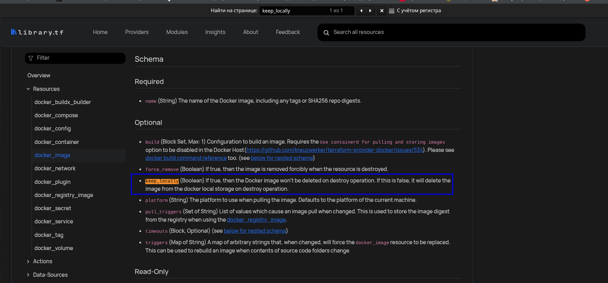

> **keep_locally** (Boolean) If true, then the Docker image won't be deleted on destroy operation. If this is false, it will delete the image from the docker local storage on destroy operation.

Этот параметр предотвращает удаление образа из локального хранилища Docker при выполнении `terraform destroy`, что позволяет переиспользовать образ в будущем без повторной загрузки.

---

## Задание 2* (со звёздочкой)

### Создание ВМ и развёртывание MySQL

**1. Создание ВМ в Yandex Cloud:**
- ОС: Ubuntu 22.04
- Конфигурация: 2 vCPU, 1 GB RAM
- Публичный IP: 62.84.118.4

**2. Установка Docker на ВМ:**
```bash
ssh ubuntu@62.84.118.4
sudo apt update
sudo apt install -y docker.io
sudo usermod -aG docker $USER
```

**3. Настройка remote Docker context:**
```bash
docker -H ssh://ubuntu@62.84.118.4 ps
```

**4. Terraform конфигурация для MySQL:**
- Сгенерированы случайные пароли через `random_password`
- Образ: `mysql:8`
- Порт: 127.0.0.1:3306
- ENV-переменные:
  - MYSQL_ROOT_PASSWORD
  - MYSQL_DATABASE=wordpress
  - MYSQL_USER=wordpress
  - MYSQL_PASSWORD
  - MYSQL_ROOT_HOST=%

**5. Проверка env-переменных:**
```bash
docker exec mysql-db env | grep MYSQL
```

**Результат:**
- MYSQL_ROOT_PASSWORD=c3BaUOMqI0zGeF2K
- MYSQL_PASSWORD=v59RqOySkCyf0WaG
- MYSQL_DATABASE=wordpress
- MYSQL_USER=wordpress

**Скриншоты:**
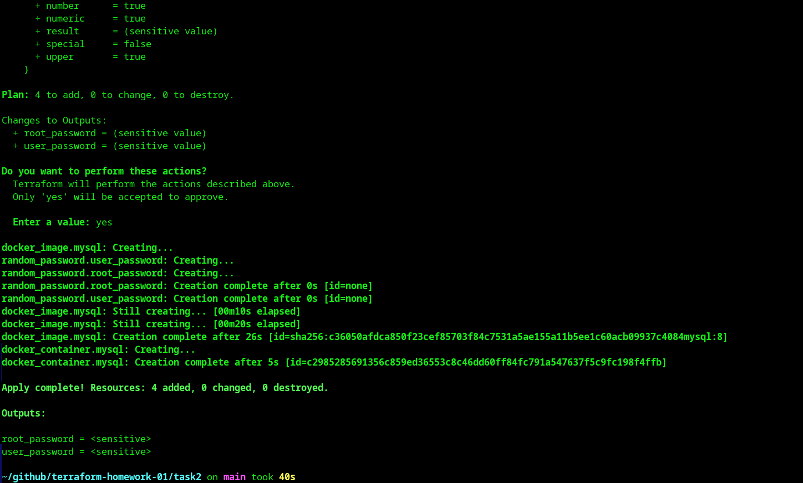
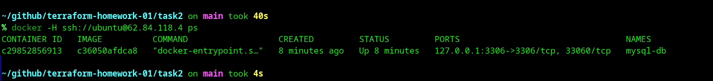
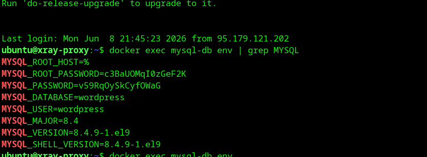


---

## Задание 3* (со звёздочкой)

*Не выполнено*

---

## Структура проекта

```
terraform-homework-01/
├── README.md
├── .gitignore
├── screenshots/           # Скриншоты выполнения
└── src/                   # Исходный код задания
    ├── main.tf
    ├── .terraformrc
    └── .gitignore
```

## Полезные команды

```bash
# Инициализация
terraform init

# Просмотр плана
terraform plan

# Применение конфигурации
terraform apply

# Применение без подтверждения
terraform apply -auto-approve

# Уничтожение ресурсов
terraform destroy

# Валидация кода
terraform validate
```

## Выводы

1. Terraform — мощный инструмент для управления инфраструктурой как кодом
2. State-файлы содержат секреты в открытом виде и требуют защиты
3. Валидация кода помогает найти ошибки до применения изменений
4. Параметр `keep_locally` полезен для сохранения образов Docker
5. Ключ `-auto-approve` удобен для автоматизации, но опасен при ручном использовании
```
